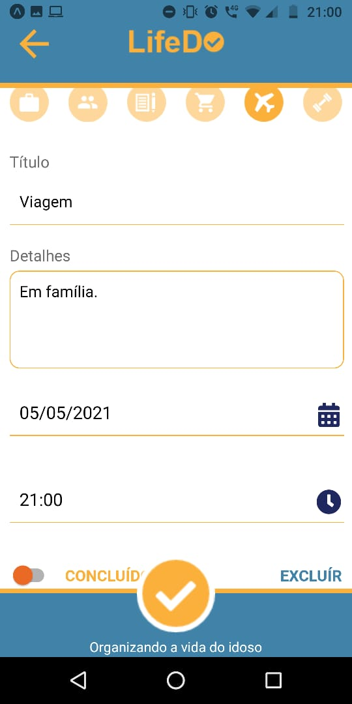

<h1>LifeDo</h1>

	A API foi desenvolvido em Node.js, as rotas da api já estão prontas.
	  
	O App está consumindo os dados que a API fornece e exibindo as tarefas
	que estão sendo salvas no Mongo, para o usuario. Cada usuario tem um 
	identificador único que é o macaddress do seu celular, exibindo assim
	somente as tarefas daquele usuario para ele mesmo.

	

		
		
		
	

	
	

